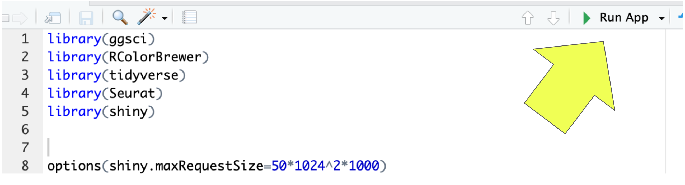
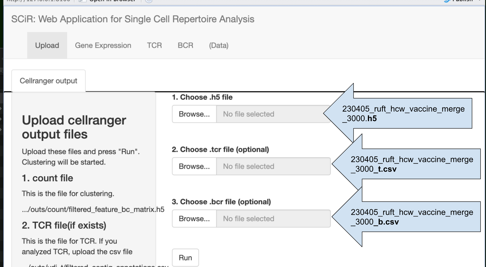

# SiCR: Web Application for Single Cell Repertoire Analysis

## 0. Inquiry 問い合わせ
Please send me any question/suggestion by using Github issues, or [Google Form](https://docs.google.com/forms/d/e/1FAIpQLSeIGfGtbFvQKhx6lF9j29nGREMCyRxD_eEcGiqcmrNFORhIMQ/viewform?usp=sf_link)  
なにか問い合わせ、ご提案ありましたらGithub　issuesか[Google Form](https://docs.google.com/forms/d/e/1FAIpQLSeIGfGtbFvQKhx6lF9j29nGREMCyRxD_eEcGiqcmrNFORhIMQ/viewform?usp=sf_link)でお問い合わせください。
## 1. Updates
2023-11-06 Inquiry page was added.  
2023-11-01 Download Button was Added.  
2023-10-31 Bug Fixed.
## 2. Introduction
SiCR is web application specialized for single cell repertoire analysis. 

The high-throughput analysis technique for the antigen receptor repertoire has been developed through Next Generation Sequencing (NGS). Additionally, with the advent of Single-Cell RNA Sequencing (scRNA-seq), it has become possible to analyze the complete sequence information of antigen receptors for each individual cell. While scRNA-seq is a powerful tool, the analysis is complex and requires various analyses to obtain accurate data. Currently, there are several user-friendly tools available for scRNA-seq, but none are specifically designed for immuno-profiling.

We have developed a web application called SiCR, which is based on R's Shiny and specializes in single-cell immune-profiling. In addition to the clustering and cell typing required for general single-cell analysis, SiCR allows for analysis of immune-profiling, such as predicting whether the chronotype is expanding in each group and which antigen the expanding chronotype targets. These analyses can be performed through mouse manipulation. Furthermore, SiCR allows for detailed figure settings, enabling immediate publication of results as a paper.

SiCR is a comprehensive workbench that can be used by all biologists for analysis. SiCR significantly reduces the time and effort required to analyze and interpret information in single-cell immune-profiling.

## 3. Install SiCR
### 3.1 Install R and R studio
If your PC (Windows, Mac, Linux) does not have R and R studio, please install these.
https://posit.co/download/rstudio-desktop/
### 3.2 Install R library packages.
SiCR uses following libraries, so please install using this command
```R
install.packages(c('ggsci', 'RColorBrewer', 'tidyverse', 'Seurat', 'shiny', 'HGNChelper', 'alakazam', 'dowser', 'hdf5r',  'BiocManager', 'openxlsx', 'hrbrhemes'))
BiocManager::install(c("Biostrings", "GenomicAlignments", "ggtree"), force=TRUE)
```
### 3.3 Download SiCR scripts, and unzip it.
Click here https://github.com/Masakazu-Ishikawa137/SiCR/archive/refs/heads/main.zip


## 4. How to use
### 4.1 Starting SiCR
1. Open the 'app.R' file in the downloaded folder using R studio.
2. Press 'Run App' button in R studio. SiCR will be launched.



## 5. Analyze
### 5.1 Demo data
We provide demo data in the downloaded folder. Please upload these datas as described below and press run.


### 5.2 cellranger outputs
After running cellranger, please upload these cellranger output files into SiCR.

1. **filtered_feature_bc_matrix.h5** (mandatory)
<p>This is a count file written in hdf5 format. This file exists in YOUR_ID/outs/count directory

2. **filtered_contig_annotations.csv** for TCR (optional)
<p>When you have data for TCR, please find this file. This file exists in YOUR_ID/outs/vdj_t directory

3. **filtered_contig_annotations.csv** for BCR (optional)
<p>When you have data for BCR, please find this file. This file exists in YOUR_ID/outs/vdj_b directory
