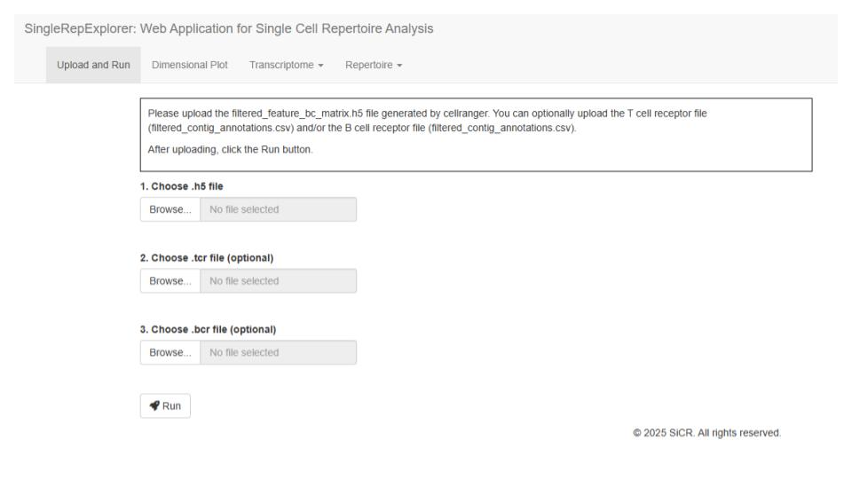

```{r setup, include=FALSE}
knitr::opts_chunk$set(echo = TRUE)
```

# {.tabset}

## 1. About

**SingleRepExplorer** is an interactive web application, built using the R/Shiny framework, designed for the comprehensive analysis of single-cell immune profiling data. It addresses the significant challenge of integrating single-cell RNA sequencing (scRNA-seq) transcriptomics with paired T-cell receptor (TCR) and B-cell receptor (BCR) repertoire analysis.

The tool is specifically designed to be accessible to biologists and researchers who may have limited bioinformatics or command-line expertise. It provides a user-friendly graphical interface that streamlines complex analytical workflows, from data input to publication-ready visualizations.

### Core Functionalities

1.  **Data Input and Processing:**
    * Accepts standard output files from 10x Genomics Cell Ranger (e.g., `filtered_feature_bc_matrix.h5` and `filtered_contig_annotations.csv`).
    * Performs an automated workflow upon data upload, including normalization, scaling, clustering, and non-linear dimensionality reduction (UMAP/t-SNE) using the **Seurat** package.

2.  **Transcriptome Analysis:**
    * **Visualization:** Offers interactive UMAP, violin plots, and feature plots to explore gene expression.
    * **Annotation:** Facilitates automated cell typing (e.g., via scType) and allows users to explore marker genes.
    * **Differential Expression:** Identifies differentially expressed genes (DEGs) between user-defined cell groups.

3.  **Immune Repertoire Analysis:**
    * **Integration:** Seamlessly combines TCR/BCR contig information with the scRNA-seq data using the **scRepertoire** package.
    * **Basic Characterization:** Provides modules to analyze clonal frequency, abundance, CDR3 length distribution, and repertoire diversity (e.g., Alpha diversity).
    * **Comparative Analysis:** Includes tools for assessing clonal overlap between samples, identifying "public" clonotypes shared across groups, and tracking the dynamics of specific clones.
    * **Advanced Features:** Offers specialized analyses such as:
        * **Antigen Prediction:** Predicts potential antigens for specific TCR clonotypes.
        * **BCR Analysis:** Visualizes isotype usage (e.g., IGHM, IGHG1) and constructs phylogenetic trees to explore clonal evolution and somatic hypermutation.

By integrating these diverse functionalities into a single workbench, SingleRepExplorer significantly reduces the time and effort required for analysis, empowering researchers to interactively explore and interpret complex single-cell immune profiling datasets.


## 2. Getting Started

`SingleRepExplorer` is distributed as a Docker container, making it easy to run on any system (Windows, macOS, or Linux). The only prerequisite is to have **Docker Desktop** installed.

### Step 1: Install Docker Desktop

If you do not already have it, please install Docker Desktop. It is a free application for Mac and Windows.

  * **Download for macOS:** [https://www.docker.com/products/docker-desktop/](https://www.docker.com/products/docker-desktop/)
  * **Download for Windows:** [https://www.docker.com/products/docker-desktop/](https://www.docker.com/products/docker-desktop/)

After installing, please **start the Docker Desktop application**. You must have it running in the background to proceed.

### Step 2: Run SingleRepExplorer

Once Docker is running, open your command-line terminal.

  * **On macOS:** Open the **"Terminal"** app (you can find it in Applications/Utilities).
  * **On Windows:** Open **"PowerShell"** or **"Command Prompt"** (you can find it in the Start Menu).

Copy and paste the following command into your terminal, then press **Enter**:

```bash
docker run --rm -p 3838:3838 amufaamo/singlerepexplorer:v1.1.11
```

This command will automatically:

1.  Download (pull) the `amufaamo/singlerepexplorer:v1.1.11` image from Docker Hub, if you don't have it.
2.  Start the application.

<!-- end list -->

  * `--rm`: This flag ensures the container is automatically removed when you stop it.
  * `-p 3838:3838`: This maps port 3838 on your computer (localhost) to the application's port 3838 inside the container.

### Step 3: Access the Application

The application is now running. Open your web browser (like Chrome, Firefox, or Safari) and navigate to the following address:

**`http://localhost:3838`**

You should now see the `SingleRepExplorer` interface and can begin your analysis.

### Stopping the Application

To stop the application, simply return to your terminal window where the command is running and press **`Ctrl+C`**.


## 3. Data Upload and Processing


The first step in using `SingleRepExplorer` is to upload your dataset via this tab. The application is designed to process outputs from the 10x Genomics Cell Ranger pipeline.

### 1. Files to Upload

You must upload the gene expression data, and you can optionally provide TCR and/or BCR repertoire files.

* **1. Choose .h5 file (Required)**
    * Upload the `filtered_feature_bc_matrix.h5` file. This contains the core single-cell gene expression data and is mandatory for all analyses.
* **2. Choose .tcr file (Optional)**
    * Upload the `filtered_contig_annotations.csv` file for the T-cell receptor (TCR) repertoire. This is required if you wish to perform TCR analysis.
* **3. Choose .bcr file (Optional)**
    * Upload the `filtered_contig_annotations.csv` file for the B-cell receptor (BCR) repertoire. This is required for BCR analysis.

After selecting a file, a green "✅ Uploaded!" status message will appear beside the button to confirm the upload.

```{r echo=FALSE, out.width="100%"}

```


### 2. Running the Analysis

Once you have uploaded the necessary files (at minimum, the .h5 file), click the blue **[Run]** button to start the analysis.

When the [Run] button is clicked, the following automated workflow is initiated on the server:

1.  **Analysis Start Notification**:
    * The [Run] button is temporarily disabled to prevent multiple clicks.
    * A status message appears: "🏃 Run button clicked. Starting analysis...".
2.  **Progress Indicator**:
    * A progress bar titled "Analysis in progress" appears (usually in the bottom-right corner) to show the current processing status.
3.  **Key Background Steps**:
    * `Loading .h5 file...`: Reads the .h5 file and creates the core Seurat object.
    * `Running Seurat object...`: Executes the standard Seurat analysis pipeline, including normalization, scaling, PCA, and non-linear dimensionality reduction (UMAP/t-SNE).
    * `Adding cell types...`: Performs automated cell type annotation.
    * `Processing TCR data...`: (If uploaded) Reads and formats the TCR data, linking it to the cells in the Seurat object.
    * `Processing BCR data...`: (If uploaded) Reads and formats the BCR data, linking it to the cells in the Seurat object.
4.  **Analysis Completion**:
    * Upon successful completion, a "🎉 Analysis finished successfully!" message is displayed.
    * The [Run] button is re-enabled, and the other analysis tabs (e.g., [Dimensional Plot], [Transcriptome], [Repertoire]) become active, allowing you to explore the results.

**Error Handling**: If you click [Run] without first uploading the mandatory .h5 file, an alert box will appear with the message: "Oops! Please upload the .h5 file first.".

---


This section provides a detailed guide to the various analysis tabs available in SingleRepExplorer.

## 4. Dimensional Plot

This tab is the primary interface for visualizing your clustered single-cell data. It allows you to explore cell populations on a 2D map (like UMAP or t-SNE) and interact with the data by coloring, renaming, and highlighting specific cell groups.

The tab is divided into a **Sidebar Panel** (left) for controls and a **Main Panel** (right) for outputs.

### Sidebar Panel: Controls

The sidebar contains all the options to customize your plot.

#### 1. Plot Display Options

* **Reduction**: Select the dimensionality reduction method to display. This is typically `UMAP` or `TSNE`. The dropdown is populated automatically from your loaded Seurat object.
* **Group by**: This is a key control. Choose which metadata column to use for coloring the cells (e.g., `seurat_clusters`, `sample`, or any custom cell type annotations).
* **Rename** (Button): Click this button to rename or regroup the categories in your selected "Group by" column.
    * A pop-up window will appear.
    * Enter a **New Group Name** (e.g., `Celltype_manual`).
    * For each existing level (e.g., Cluster "0"), you can provide a new name (e.g., "T-cells"). You can assign the same new name to multiple old levels to merge them.
    * Click "Save", and this new grouping will be added to your dataset and automatically selected in the "Group by" dropdown.
* **Point Size**: Adjusts the size of the individual dots on the plot.
* **Label Size**: Adjusts the size of the text labels for each cluster.
* **Legend Position**: Control where the plot legend is placed (or set to "none").
* **Plot Width / Height**: Adjust the dimensions of the plot in pixels.

---

#### 2. Search & Highlight

This powerful feature allows you to find specific cells based on complex criteria (including repertoire data) and highlight them on the plot.

1.  **Enable Highlight by Search**: Check this box to activate the feature. This will temporarily override the "Group by" coloring.
2.  **Select Data Source**: Choose where to search for your cells:
    * **Seurat Metadata**: Search any categorical column in the main Seurat object (e.g., `seurat_clusters`, `sample`).
    * **TCR Clonotypes**: (If loaded) Search the TCR data table.
    * **BCR Clonotypes**: (If loaded) Search the BCR data table.
3.  **Select Column to Search**: Based on your source, select a column to search (e.g., `raw_clonotype_id` from TCR data, or `seurat_clusters` from Metadata).
4.  **Select Value(s) to Highlight**: Type or select one or more values from the chosen column (e.g., a specific clonotype ID like "clonotype10").
5.  **Apply Highlight**: Click this button. The plot will update to show all cells matching your criteria in **dark blue**, while all other cells will be greyed out.

To return to the "Group by" cluster view, simply **uncheck** the "Enable Highlight by Search" box.

### Main Panel: Outputs

#### 1. Plot

This area displays the dimensional reduction plot you have configured.
* **Download plot (.pdf)**: Click to download the current plot as a high-resolution, publication-ready PDF.

#### 2. Coordinates Table

This is an interactive table showing the underlying data for the plot.
* It displays the selected "Group by" information (e.g., `seurat_clusters`) and the X/Y coordinates (e.g., `UMAP_1`, `UMAP_2`) for every cell.
* **Download Table (.csv)**: Click to download this full data table as a CSV file.


## 5. Expression Visualization

This tab allows you to visualize the expression levels of specific genes across your single-cell dataset using several common plot types. The plot updates interactively as you change the settings, without requiring a "Run" button.

### Sidebar Panel: Controls

#### 1. Plot & Gene Selection

* **Plot type**: Select the type of visualization.
    * **Feature plot**: Overlays gene expression onto a dimensional reduction plot (e.g., UMAP).
    * **Violin plot**: Shows the distribution of gene expression for each group.
    * **Dot plot**: Displays the average expression and percentage of cells expressing a gene for each group.
    * **Heatmap**: Shows the expression of multiple genes across multiple cell groups.
* **Enter or select gene names**: Type or select one or more gene names to visualize (e.g., `CD3E`, `CD19`). The list is populated from your dataset.

#### 2. Plot-Specific Options

The available options change based on the selected "Plot type":

* **Group by**: (Available for `Violin plot`, `Dot plot`, `Heatmap`) Select the metadata column to group cells by (e.g., `seurat_clusters`, `sample`).
* **Reduction**: (Available for `Feature plot`) Select the dimensional reduction plot to use (e.g., `UMAP`, `TSNE`).
* **Point Size**: (Available for `Feature plot`, `Violin plot`) Adjust the size of the individual dots.
* **Plot Width / Height**: Adjust the dimensions of the plot in pixels.
* **Legend Position**: Control where the plot legend is placed.

### Main Panel: Outputs

#### 1. Plot

This area displays the gene expression plot based on your selections.

* **Download plot (.pdf)**: Click to download the current plot as a high-resolution, publication-ready PDF, saved using the dimensions specified in the sidebar.


## 5. Differential Expression

This module allows you to perform **Differential Gene Expression (DGE)** analysis to identify genes that are expressed at different levels between cell populations. It operates in two distinct modes.

### Sidebar Panel: Controls

#### 1. Analysis Setup

* **Comparison Type**: This is the most important setting.
    * **"To entire dataset" (Marker Identification)**: This mode finds marker genes for *each* group. It compares one group (e.g., "Cluster 1") against all other cells combined ("Cluster 1 vs. All"). It repeats this for every group.
    * **"Between selected group(s)" (Direct Comparison)**: This mode compares two specific groups directly (e.g., "Cluster 1 vs. Cluster 2").

* **Group by**: Select the metadata column that defines your cell groups (e.g., `seurat_clusters`, `sample`, or your custom `Celltype_manual`).

* **Log fold change (Threshold)**: Sets the minimum log-fold change (e.g., 0.1) for a gene to be considered differentially expressed.

* **Minimum percentage of cells... (min.pct)**: Sets the minimum percentage of cells in either population that must express the gene (e.g., 0.01 = 1%).

* **Run** (Button): Click this to start the DGE calculation after setting your parameters.

#### 2. Mode-Specific Options

**If "Comparison Type" is "To entire dataset":**

* **Show Features**:
    * `Only Up-regulated`: Returns only genes that are *higher* in the group of interest.
    * `Only Down-regulated`: Returns only genes that are *lower* in the group of interest.
    * `Both`: Returns all differentially expressed genes.
* **Number of markers**: (Appears after "Run") The number of top markers to display in the summary table (e.g., 10).
* **Threshold of adjusted p-value**: (Appears after "Run") The p-value cutoff for the summary table.

**If "Comparison Type" is "Between selected group(s)":**

* **Target cluster(s)**: Select the group(s) you are interested in (this is `ident.1` in the comparison).
* **Reference cluster(s)**: Select the group(s) you want to compare against (this is `ident.2`).
* **Highlight Genes**: (Appears after "Run") Enter a comma-separated list of gene names (e.g., `CD8A, GZMB`) to highlight them on the volcano plot.
* **Plot Customization**: (Appears after "Run") Adjust p-value thresholds, point sizes, and plot dimensions.

---

### Main Panel: Outputs

The main panel's display changes based on the "Comparison Type" you selected.

#### If "To entire dataset" (Marker Identification)

* **Most Differentially Expressed Features (markers) for Each Group**:
    * A summary table showing the top marker genes (based on your settings) for each cluster, formatted as a comma-separated list for easy viewing.
    * `Download marker table (.csv)`: Downloads this summary table.

* **Differentially Expressed Features across Groups**:
    * A complete, interactive data table containing *all* differential expression results for *all* clusters.
    * You can use the search boxes at the top of columns to filter for specific genes (e.g., `gene` column) or clusters (e.g., `cluster` column).
    * `Download all table (.csv)`: Downloads this full results table.

#### If "Between selected group(s)" (Direct Comparison)

* **Volcano Plot**:
    * An interactive plot visualizing the results. The X-axis is the **log-fold change** (positive values are up-regulated in your "Target" group), and the Y-axis is the **-log10 adjusted p-value** (higher means more significant).
    * Hover over points to see gene names.
    * Genes entered in the "Highlight Genes" box will be colored red and labeled.
    * `Download Plot (PDF)`: Downloads a static, publication-quality PDF of the volcano plot.

* **Differentially Expressed Features...**:
    * A complete, interactive data table showing the full results for the *single comparison* you performed.
    * `Download all table (.csv)`: Downloads this data table.

---

## [Repertoire] Tab {.tabset}

This tab provides a suite of tools for in-depth analysis of immune repertoires.

### Clonotype Information

This tab serves as the primary data browser for your repertoire. It provides a comprehensive, filterable table of every unique clonotype identified in your dataset, along with all associated V(D)J gene usage and sequence information.

#### Sidebar Panel: Controls

* **VDJ Type**: This is the only control. You must select whether you want to inspect the **TCR** or **BCR** clonotype table. The main panel will update based on this selection.

#### Main Panel: Outputs

* **Clonotype Data Table**:
    This powerful, interactive table displays the detailed annotation for each unique clonotype.
    * **Filtering**: You can type in the search boxes at the top of each column to filter the entire table. For example, you can search for a specific `TCR_TRA_v_gene` or `raw_clonotype_id`.
    * **Sorting**: The table is sorted by default based on the clonotype ID (`raw_clonotype_id`) to group related subclones together. You can also click any column header to re-sort.

    The table contains extensive information, including:
    * **Clonotype IDs**: `raw_clonotype_id`, `exact_subclonotype_id`.
    * **Paired Sequences**: `CTgene` (V/J genes), `CTaa` (CDR3 amino acid), `CTnt` (CDR3 nucleotide).
    * **Chain 1 (TRA or IGH) Details**: V, D (if applicable), J, and C genes.
    * **Chain 2 (TRB or IGL/K) Details**: V, D (if applicable), J, and C genes.
    * **Full Sequences**: All framework (FWR) and complementarity-determining regions (CDR) for both nucleotide and amino acid sequences of each chain.

* **Download table (.csv)**:
    Click this button to download the complete data table (respecting the "TCR" or "BCR" selection) as a CSV file for further analysis.

### Frequency Analysis

This versatile module allows you to analyze and visualize the frequencies of two different targets:
1.  **Clonotype Frequency**: (e.g., the "Top 10" most abundant clonotypes)
2.  **Gene Usage**: (e.g., the usage frequency of different V-genes)

#### Sidebar Panel: Controls

##### 1. Main Setup

* **Analysis Target**: This crucial toggle switches the entire module's function.
    * `Clonotype Frequency`: Analyzes the abundance of the most frequent clonotypes (e.g., "clonotype1", "clonotype2").
    * `Gene Usage`: Analyzes the abundance of specific gene segments (e.g., `TRBV6-5`, `TRAV8-1`).
* **VDJ Type**: Select whether to analyze **TCR** or **BCR** data.
* **Group by**: Choose the metadata column used to group the cells (e.g., `sample`, `seurat_clusters`).

##### 2. Mode-Specific Options

The options here change based on your "Analysis Target" selection.

* **If "Clonotype Frequency" is selected:**
    * `Top N Clonotypes`: Specify how many of the most abundant clonotypes you want to display (e.g., 10).
* **If "Gene Usage" is selected:**
    * `Target Gene Column`: Select the specific gene segment you want to analyze. The choices update based on your VDJ Type (e.g., `TCR_TRB_v_gene`, `BCR_IGH_c_gene`, or combined V-J pairs like `TCR_TRA_v_j_pair`).

##### 3. Plot & Display Options

* **Plot Type**: Choose the visualization style:
    * `Barplot (Dodged)`: Shows groups side-by-side for each item (clonotype/gene).
    * `Barplot (Stacked)`: Stacks groups on top of each other for each item.
    * `Barplot (Normal)`: (*Clonotype Frequency only*) Shows a single bar for each clonotype, representing its total frequency across all *filtered* groups.
    * `Heatmap`: Displays a matrix of groups vs. items, with color intensity representing frequency.
* **Display Value**: Toggles the Y-axis (or color for heatmap).
    * `Count`: Shows the raw number of cells.
    * `Percentage`: **(Important)** This logic changes based on the plot type:
        * For `Stacked`, `Dodged`, and `Heatmap`: Shows the percentage *within that group* (e.g., 5% of "Sample A" uses this gene).
        * For `Normal` plots: Shows the percentage *of the total filtered dataset* (e.g., "clonotype1" makes up 2% of all cells).
* **Filter Groups**: A list of checkboxes will appear based on your "Group by" selection (e.g., all samples). You can uncheck groups to exclude them from the analysis.
* **Sort X-axis by group**: (`Dodged` plots only) Choose which group's value (or "Overall") should be used to sort the X-axis (clonotypes/genes) from highest to lowest.
* **Horizontal Barplot**: (`Barplot` types only) Toggles the bar plots from vertical to horizontal.
* **Common Plot Options**: Adjust the `Plot Width`, `Plot Height`, and `Legend Position`.

#### Main Panel: Outputs

* **Plot**:
    Displays the configured bar chart or heatmap.
    * `Download plot (.pdf)`: Click to download the visualization as a publication-ready PDF.
* **Table**:
    Shows the summary data table used to generate the plot, with exact counts and percentages.
    * `Download table (.csv)`: Click to download this summary data as a CSV file.

### Unique Clones

This module helps quantify the diversity of your repertoire by answering the question: "How many different types of clonotypes exist within each group?"

It generates a bar chart showing the total count (or proportion) of unique clonotypes found within each user-defined group (e.g., sample, cluster).

#### Sidebar Panel: Controls

* **VDJ Type**: Select whether to analyze **TCR** or **BCR** data.
* **Group by**: Choose the metadata column used to group the cells (e.g., `sample`, `seurat_clusters`). The analysis will count unique clonotypes *per* group.
* **Value Type**: Choose what the Y-axis of the bar chart represents:
    * **Count**: Shows the absolute number of unique clonotypes in that group (e.g., "Cluster 1 has 500 unique clonotypes").
    * **Percentage**: Shows the proportion of unique clonotypes relative to the total number of cells in that group (e.g., "In Cluster 1, 10% of cells are unique clonotypes").
* **Common Plot Options**: Adjust the plot dimensions (`Plot Width`, `Plot Height`) and the legend position.

#### Main Panel: Outputs

* **Plot**:
    A bar chart where each bar represents a group (from your "Group by" selection). The height of the bar shows either the total count or the proportion of unique clonotypes, based on your "Value Type" selection.
    * `Download plot (.pdf)`: Downloads the bar chart as a publication-ready PDF.

* **Table**:
    An interactive data table showing the summary data used to generate the plot. It includes:
    * `Group`: The categories from your "Group by" selection.
    * `unique_clonotype_count`: The absolute number of unique clonotypes.
    * `total_clonotype_count`: The total number of cells (barcodes) in that group.
    * `proportion_unique`: The calculated percentage (unique / total).
    * `Download table (.csv)`: Downloads this summary table as a CSV file.

### Clonal Abundance

This module visualizes the **clonal abundance distribution** for each group. It plots the abundance (either as a proportion or raw count) of each clonotype against its rank within its group. This type of plot is useful for assessing clonal dominance and evenness – for example, a steep drop-off indicates that a few clones dominate the repertoire, while a flatter curve suggests a more even distribution.

#### Sidebar Panel: Controls

* **VDJ Type**: Select whether to analyze **TCR** or **BCR** data.
* **Group by**: Choose the metadata column used to group the cells (e.g., `sample`, `seurat_clusters`). The plot will show a separate line for each group.
* **Y-Axis Unit**: Choose what the Y-axis represents:
    * `Percentage`: Shows the proportion of each clonotype relative to the total number of cells *within that group*.
    * `Count`: Shows the raw number of cells for each clonotype.
* **Filter Groups**: A list of checkboxes will appear based on your "Group by" selection. You can uncheck groups to exclude them from the analysis and plot.
* **Common Plot Options**: Adjust the `Plot Width`, `Plot Height`, and `Legend Position`.

#### Main Panel: Outputs

* **Plot**:
    Displays a **rank-abundance plot**.
    * **X-axis**: Shows the rank of the clonotypes within each group (log scale), ordered from most abundant (rank 1) to least abundant.
    * **Y-axis**: Shows the abundance of the clonotype at that rank, either as a percentage or count, based on your selection.
    * **Color**: Each line represents a different group defined by your "Group by" selection.
    * `Download plot (.pdf)`: Downloads the rank-abundance plot as a publication-ready PDF.
* **Table**:
    An interactive data table showing the data used for the plot. It includes:
    * The grouping column (e.g., `sample`).
    * `raw_clonotype_id`: The identifier for each clonotype.
    * `count`: The raw number of cells for that clonotype in that group.
    * `proportion`: The calculated proportion of that clonotype within its group.
    * `rank`: The rank of that clonotype within its group based on abundance.
    * `Download table (.csv)`: Downloads this summary data as a CSV file.

### Clonal Length

This module analyzes the length distribution of specific repertoire sequences, most commonly the CDR3. It allows you to visualize and compare whether different cell groups (e.g., samples or clusters) have different characteristic lengths for their receptor sequences.

#### Sidebar Panel: Controls

* **VDJ Type**: Select whether to analyze **TCR** or **BCR** data.
* **Target Column (for Length Calculation)**: This is the key control. Select the sequence you wish to measure. The choices update based on your VDJ Type.
    * For TCR, you can select `TCR_TRB_cdr3` (amino acid length) or `TCR_TRB_cdr3_nt` (nucleotide length), among other chain options.
    * For BCR, you can select `BCR_IGH_cdr3`, `BCR_IGK_cdr3`, etc.
* **Group by**: Choose the metadata column used to group the cells (e.g., `sample`, `seurat_clusters`). The plot will show a separate distribution for each group.
* **Filter Groups**: A list of checkboxes will appear based on your "Group by" selection. You can uncheck groups to exclude them from the analysis.
* **Plot Type**: Choose the visualization style:
    * `Dodged Bars`: Shows the distribution for each group side-by-side. Ideal for comparing specific length counts.
    * `Stacked Bars`: Stacks the group distributions. Ideal for comparing the *proportion* of lengths across groups.
    * `Boxplot`: Visualizes the statistical summary (median, quartiles, range) of lengths for each group.
* **Display Value** (Bar plots only):
    * `Count`: The Y-axis shows the raw number of cells for each length.
    * `Percentage (%)`: The Y-axis shows the percentage *within that group* (e.g., in "Sample A", 20% of cells have a CDR3 length of 15).
* **Horizontal Barplot** (Bar plots only): Toggles the bar plots from vertical to horizontal.
* **Common Plot Options**: Adjust the `Plot Width`, `Plot Height`, and `Legend Position`.

#### Main Panel: Outputs

* **Plot**:
    Displays the configured bar chart or boxplot showing the length distributions.
    * `Download plot (.pdf)`: Click to download the visualization as a publication-ready PDF.
* **Table**:
    An interactive data table showing the summary data used to generate the bar charts. It lists each group, each observed sequence length, the raw count, and the calculated percentage. (Note: The boxplot uses the non-summarized raw length data).
    * `Download table (.csv)`: Click to download this summary data as a CSV file.

### Track Clonotype

This powerful module allows you to track the abundance of specific, user-selected clonotypes across different groups (e.g., samples, clusters, or time points). It is ideal for visualizing how particular clones expand, contract, or are shared between populations.

This module can generate two types of visualizations: a **Stacked Bar** chart or an **Alluvial Plot**.

#### Sidebar Panel: Controls

* **VDJ Type**: Select whether to analyze **TCR** or **BCR** data.
* **Clone Identifier Column**: Choose which column to use for identifying clonotypes. This is a crucial setting.
    * e.g., `raw_clonotype_id`, `TCR_pair_CTaa` (for paired CDR3 amino acids), or `BCR_IGH_cdr3`.
* **Target Clonotypes**: Based on your column selection, this box allows you to select one or *multiple* clonotypes from the list that you wish to track.
* **Group by**: Choose the metadata column that defines your groups for tracking (e.g., `sample`, `seurat_clusters`).
* **Plot Type**: Select the visualization style:
    * `Stacked Bar`: Shows a bar for each group, where each segment's height represents the abundance of a tracked clonotype.
    * `Alluvial Plot`: Shows the "flow" of the tracked clonotypes from one group to the next. This is excellent for visualizing changes across ordered groups (like time points).
* **Value Type**: Toggles the Y-axis.
    * `Frequency (%)`: Shows the clonotype's abundance as a percentage *within that group's total cells*.
    * `Count`: Shows the raw cell count for that clonotype in that group.
* **Group Order**: Enter a comma-separated list to define the exact order of the groups on the X-axis (e.g., `Sample_A, Sample_B, Sample_C`). This is essential for Alluvial plots.
* **Legend/Plot Options**: Adjust the legend position, plot width, and plot height.
* **Download Buttons**: Buttons to download the generated plot and the underlying data table.

#### Main Panel: Outputs

* **Clonotype Tracking Plot**:
    Displays the Stacked Bar or Alluvial plot.
    * **Stacked Bar**: Useful for seeing the relative contribution of each tracked clone to each group.
    * **Alluvial Plot**: Useful for seeing the "flow" and proportional changes of specific clones as they move between groups.
    * `Download plot (.pdf)`: Downloads the visualization as a publication-ready PDF.
* **Tracking Results Table**:
    An interactive data table showing the raw data for the plot. It lists each tracked clonotype, each group, its raw count (`n`), the total cells in that group (`total_n`), and its calculated frequency (`frequency`).
    * `Download table (.csv)`: Downloads this summary data as a CSV file.

### Clonal Overlap

This module is used to compare the similarity between the repertoires of different groups. It calculates an "overlap coefficient" for every pair of groups and displays the results as a heatmap, allowing you to quickly see which groups share the most clonotypes.

#### Sidebar Panel: Controls

* **VDJ Type**: Select whether to analyze **TCR** or **BCR** data.
* **Clone Identifier Column**: This is a key setting. You must define what constitutes a "clonotype" for the overlap calculation.
    * e.g., `TCR_pair_CTaa` (paired CDR3 amino acid sequence), `raw_clonotype_id`, or `BCR_IGH_cdr3`.
* **Group by**: Choose the metadata column that defines the groups you want to compare (e.g., `sample`, `seurat_clusters`). You must have at least two groups to perform an analysis.
* **Common Plot Options**: Adjust the `Plot Width`, `Plot Height`, and `Legend Position`.

#### Main Panel: Outputs

* **Plot**:
    This panel displays a **heatmap** of the overlap scores.
    * Both the X-axis and Y-axis list the groups you selected (e.g., "Sample A", "Sample B").
    * Each tile's color (and the number inside it) represents the overlap coefficient between the two corresponding groups.
    * **Calculation**: The value is the **Overlap Coefficient** (Szymkiewicz–Simpson coefficient), which is calculated as:
        `(Number of shared clonotypes) / (Size of the smaller repertoire)`
    * A value of **1.0** (darkest color) means 100% overlap. The diagonal will always be 1.0, as a group perfectly overlaps with itself.
    * A value of **0.0** (lightest color) means the two groups share no clonotypes.
    * `Download plot (.pdf)`: Click to download the heatmap as a publication-ready PDF.
* **Table**:
    An interactive data table showing the raw matrix of overlap coefficients used to generate the plot.
    * The rows and columns represent the groups, and the cells contain the calculated overlap values (rounded to 3 decimal places).

### Clonal Proportion

This module helps you understand the **clonal expansion structure** within each group (e.g., sample or cluster). It categorizes clonotypes based on their size (i.e., how many cells share the same clonotype) and displays the proportion of cells belonging to each size category as a stacked bar chart. This allows you to easily compare whether some groups are dominated by large, expanded clones while others consist mostly of unique or rare clones.

#### Sidebar Panel: Controls

* **VDJ Type**: Select whether to analyze **TCR** or **BCR** data.
* **Group by**: Choose the metadata column used to group the cells (e.g., `sample`, `seurat_clusters`). The analysis will calculate proportions *within* each of these groups.
* **Clone Definition**: Select which column defines a unique clonotype.
    * `Clonotype ID` (`raw_clonotype_id`): Uses the pre-defined clonotype ID (often based on shared V/J genes and CDR3 sequence similarity).
    * `CDR3 nucleotide` (`nt`): Defines clonotypes based on the exact CDR3 nucleotide sequence (will likely result in more "unique" clones).
    * `CDR3 amino acid` (`aa`): Defines clonotypes based on the exact CDR3 amino acid sequence.
* **Chain** (Appears after selecting VDJ type, primarily for TCR): Choose whether the analysis should consider both chains, or only TRA or TRB when defining clonotypes based on CDR3 sequences. *(Note: Current implementation calculates counts based on the 'Clone Definition' column irrespective of this selection, but it might be used for filtering in future versions)*.
* **Clonal Size Categories (Upper Limits)**: These numeric inputs define the boundaries for categorizing clonotype sizes based on their count (`Ct`).
    1.  **Unique Max Count**: Clonotypes with a count less than or equal to this value (e.g., `1`) are categorized as "Unique".
    2.  **Rare Max Count**: Clonotypes with a count greater than the 'Unique' limit but less than or equal to this value (e.g., `5`) are categorized as "Rare".
    3.  **Small Max Count**: (e.g., count > 5 and <= `20`).
    4.  **Medium Max Count**: (e.g., count > 20 and <= `100`).
    5.  **Large Max Count**: (e.g., count > 100 and <= `1000`).
    6.  **Hyperexpanded Max Count**: (e.g., count > 1000 and <= `10000`).
    * Any clonotype with a count greater than the 'Hyperexpanded' limit falls into the final "Ct > [Hyperexpanded Max]" category.
* **Legend/Plot Options**: Adjust the legend position, plot width, and plot height.
* **Download Buttons**: Buttons to download the plot and the data table.

#### Main Panel: Outputs

* **Clonal Proportion by Size Category Plot**:
    Displays a **stacked bar chart**.
    * **X-axis**: Shows the different groups selected via "Group by".
    * **Y-axis**: Represents 100% for each group.
    * **Fill Colors**: Each colored segment within a bar represents one of the clonal size categories defined in the sidebar (Unique, Rare, Small, etc.). The height of the segment shows the percentage of cells within that group that belong to clonotypes of that size category.
    * `Download plot (.pdf)`: Downloads the stacked bar chart as a publication-ready PDF.
* **Proportion Data Table**:
    An interactive data table showing the summary data used for the plot. It includes:
    * The grouping column (e.g., `sample`).
    * `category`: The clonal size category label.
    * `n`: The number of *clonotypes* belonging to that category in that group.
    * `percentage`: The percentage of *cells* in that group belonging to clonotypes of that category (this is what's plotted).
    * `Download table (.csv)`: Downloads this summary table as a CSV file.

### Public Clonotype

This module helps identify **"public clonotypes"** – clonotypes that are shared across two or more different groups (e.g., samples, clusters). It visualizes the overlap using a Venn diagram and allows you to inspect the details of the clonotypes found in specific intersections.

#### Sidebar Panel: Controls

* **VDJ Type**: Select whether to analyze **TCR** or **BCR** data.
* **Group by**: Choose the metadata column that defines the groups you want to compare (e.g., `sample`, `seurat_clusters`).
* **Select groups to compare**: (Appears after selecting "Group by") This multi-select dropdown allows you to choose **2 to 4 groups** from your dataset to compare in the Venn diagram. Choosing more than 4 groups can make the diagram difficult to interpret.
* **Table Value Unit**: Choose how the abundance data is displayed in the details table (see Main Panel):
    * `Count & Proportion`: Show both raw cell counts and proportions.
    * `Count`: Show only raw cell counts.
    * `Proportion`: Show only the proportion within each group.
* **Common Plot Options**: Adjust the `Plot Width` and `Plot Height` for the Venn diagram area. *(Note: Legend Position is less relevant for the Venn diagram itself)*.

#### Main Panel: Outputs

* **Public Clonotypes Venn Diagram**:
    Displays a **Venn diagram** illustrating the overlap of unique clonotypes (`raw_clonotype_id`) between the selected groups.
    * Each circle represents a group.
    * The numbers indicate the count of **unique clonotypes** found exclusively in that section (either specific to one group or shared only by the groups in that intersection).

* **Clonotype Details**:
    * **Select intersection to inspect**: This dropdown menu lists all possible intersections shown in the Venn diagram (including sections unique to a single group). The number of unique clonotypes in each section is shown in parentheses. Select the intersection you want to investigate further.
    * **Clonotype Table**: This interactive data table displays detailed information about the clonotypes found **only in the selected intersection**.
        * `raw_clonotype_id`: The identifier of the public clonotype.
        * Subsequent columns show the **abundance** (count and/or proportion, based on your sidebar selection) of that specific clonotype within each of the originally selected groups. This allows you to see not just *that* a clone is shared, but also how prevalent it is in each group where it appears.

### Antigen Prediction

This module attempts to predict the antigen specificity of your clonotypes by matching their CDR3 sequences against a pre-compiled database of known antigen-specific receptors.

#### Sidebar Panel: Controls

* **VDJ Type**: Select whether to analyze **TCR** or **BCR** data. This selection determines:
    1.  Which antigen database to load (TCR or BCR).
    2.  Which CDR3 column from your data to use for matching (TCR: `TCR_TRB_cdr3`; BCR: `BCR_IGH_cdr3`).
* **Download table (.csv)**: Click this button to download the complete **source antigen database file** (TCR or BCR) that is being used for the comparison.

#### Main Panel: Outputs

* **Antigen Prediction Table - Matched CDR3s**:
    This interactive data table displays the results of the prediction. **This table only shows clonotypes from your dataset that had an exact match in the database.**
    
    The module performs an "inner join," meaning if a clonotype's `TCR_TRB_cdr3` (for TCR) or `BCR_IGH_cdr3` (for BCR) sequence is not found in the database, it will *not* appear in this list.
    
    The resulting table shows:
    * `raw_clonotype_id`: Your clonotype's ID.
    * `exact_subclonotype_id`: Your clonotype's subclonotype ID.
    * The matched CDR3 sequence (e.g., `TCR_TRB_cdr3`).
    * `Epitope_sequence`: The epitope sequence from the database.
    * `Epitope_gene`: The gene associated with the epitope.
    * `Epitope_species`: The species associated with the epitope.

### Phylogenetic Tree (Data Viewer)

This module is designed to facilitate the exploration of clonal evolution, specifically for B-cell receptors (BCRs). **Currently, this module allows you to select a specific BCR clone (one that contains multiple related subclones) and view the raw data for all cells belonging to that clone.** The functionality for building and displaying the actual phylogenetic tree is under development.

This module is primarily intended for **BCR analysis only** at this time.

#### Sidebar Panel: Controls

* **Select Clone**: This dropdown menu lists all BCR `raw_clonotype_id` values from your dataset that contain **more than one** unique `exact_subclonotype_id`. This pre-filtering helps you focus on clones that have likely undergone some level of diversification (potentially somatic hypermutation).
* **Display Clone Data**: Click this button after selecting a clone. It triggers the server to filter the BCR data and display the relevant information in the main panel.

#### Main Panel: Outputs

* **Plot Area**: *(Currently inactive)* This area is reserved for displaying the phylogenetic tree visualization once the feature is implemented.
* **Selected Clone Data Table**:
    This table displays the raw data rows from your BCR dataset that correspond to the clone you selected in the sidebar. This includes columns like:
    * `barcode`
    * `raw_clonotype_id`
    * `exact_subclonotype_id`
    * `BCR_IGH_full_length_nt` (the sequence potentially used for tree building)
    * `sample`, `seurat_clusters`, `BCR_IGH_c_gene`, etc. (any other available metadata).
    
    This allows you to inspect the individual sequences and associated metadata for the cells within the selected evolving clone.